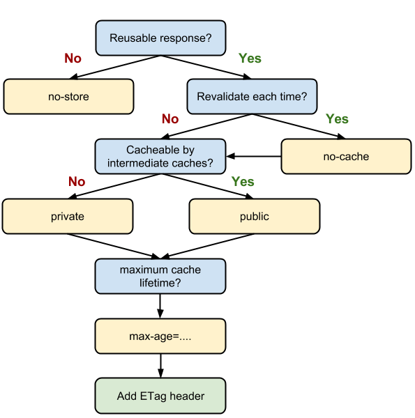

# cahce_control
> [MDN Cache 정책](https://developer.mozilla.org/ko/docs/Web/HTTP/Headers/Cache-Control)

> [웹 캐쉬 실무 정리](https://cyberx.tistory.com/9)

> [초보자에게 쉽게 설명된 cache & cookie](https://www.zerocho.com/category/HTTP/post/5b594dd3c06fa2001b89feb9)

> https://kdevkr.github.io/archives/2018/understanding-cache-control/

## Session, Cookie, Cache

`Cookie`
1. 장바구니와 같은 보안 상관없는 데이터
2. 세션과 함께 로그인
  - 사용자가 처음 웹에 접속하게 되면 서버는 세션을 하나 생성하고, 세션에 해당하는 쿠키를 사용자에게 생성합니다. 이 쿠키는 사용자가 웹 페이지를 접속할 때마다 서버에 보내지게 되는데요. 이를 통해  세션이 있다면 로그인 유지시켜준다.

`Session`

쿠키에서 저장하지 않는 "중요한 데이터"를 서버에서 저장할 때 주로 사용

`Cache`

홈페이지를 접속하면 css, js, 이미지 파일이 사용자의 브라우저에 저장이 됩니다. 그 후 다시 같은 홈페이지를 접속하게 되면 css, js, 이미지 파일을 서버가 아닌 사용자의 PC에서 가져오게 됩니다.

## 자주 쓰는 Cache-Control

`Cache-Control: no-store`
> 먼저 아무것도 캐싱하지 않으려면 사용 하면됩니다. 또는 no-cache, no-store, must-revalidate로 no 시리즈를 다 붙여줍니다.

`Cache-Control: no-cache`
> 는 가장 많이 헷갈려하는 헤더 설정인데요. no-cache이지만 cache하지 말라는 뜻이 아닙니다!!! 모든 캐시를 쓰기 전에 서버에 이 캐시 진짜 써도 되냐고 물어보라는 뜻입니다.

`Cache-Control: must-revalidate`
> must-revalidate는 만료된 캐시만 서버에 확인을 받도록 하는 겁니다. no-cache랑 must-revalidate는 이름이 잘못 지어진 감이 있습니다.

`Cache-Control: public 또는 private`
> public이면 공유 캐시(또는 중개 서버)에 저장해도 된다는 뜻이고 private이면 브라우저같은 특정 사용자 환경에만 저장하라는 뜻입니다.

`Cache-Control: public, max-age=3600`
> max-age로 캐시 유효시간을 줄 수 있습니다. 초 단위이므로 위 예제에서는 1시간입니다. 1시간이 지나면 이 응답 캐시는 만료된 것으로 여겨집니다.

## 상세한 cache-Control 정리
max-age=[sec]
>  Expires 와 동일한 의미지만 고정된 절대 시간 값이 아닌 요청 시간으로부터의 상대적 시간을 표시합니다. 

s-maxage=[sec]
> max-age와 동일한 의미지만 shared caches(예:proxy)에만적용됩니다. 명시된 경우 max-age나 Expires보다 우선순위를 가집니다.

public
> 일반적으로 HTTP인증이 된 상태에서 일어나는 응답은 자동으로private이 됩니다. public을 명시적으로 설정하면 인증이 된 상태더라도 캐쉬 하도록합니다.

private
> 특정 유저(사용자의 브라우저)만 캐쉬 하도록 설정 합니다. 여러사람이 사용하는 네트워크상의 중간자 (intermediaries)역할을 하는 shared caches (예: proxy) 에는경우 캐쉬되지 않습니다.

no-cache
> 응답 데이터를 캐쉬하고는 있지만, 먼저 서버에 요청해서 유효성검사(validation)을 하도록 강제 합니다. 어느 정도 캐쉬의 효용을 누리면서도 컨텐츠의 freshness를 강제로유지하는데 좋습니다.

no-store
> 어떤 상황에서도 해당 response 데이터를 저장하지 않습니다.

no-transform
> 어떤 프록시들은 어떤 이미지나 문서들을 성능향상을 위해최적화된 포맷으로 변환하는 등의 자동화된 동작을 하는데 이러한 것을 원치 않는다면 이 옵션을 명시해주는 것이좋습니다.

must-revalidate
> HTTP는 특정 상황(네트워크 연결이 끊어졌을 때 등)에서는fresh하지 않은 캐쉬 데이터임에도 불구하고 사용하는  경우가있는데, 금융거래 등의 상황에서는 이러한 동작이 잘못된 결과로이어질 가능성이 있기 때문에 이 지시자를  통해서 그러한 사용을방지합니다.

proxy-revalidate
> must-revalidate와 비슷하지만 shared caches (예: proxy)에만적용됩니다.

## HTTP Cache 정책

