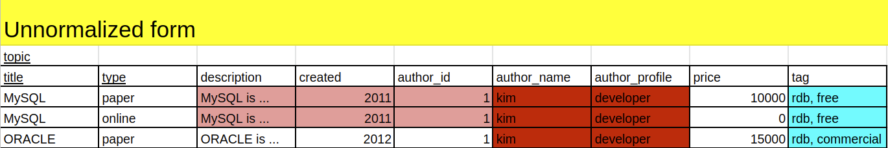
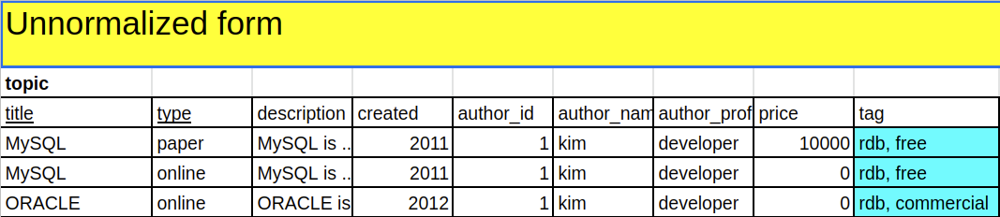
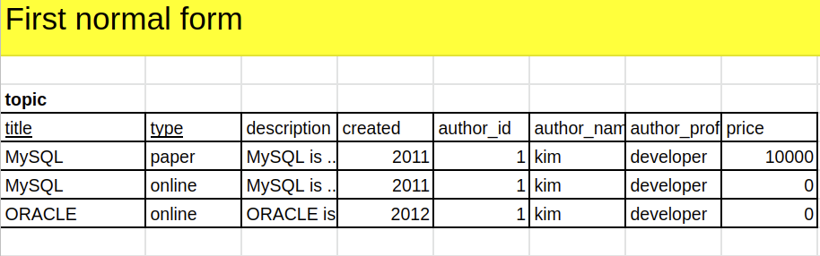
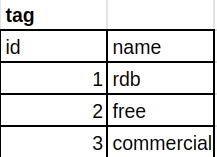
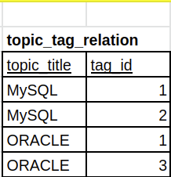
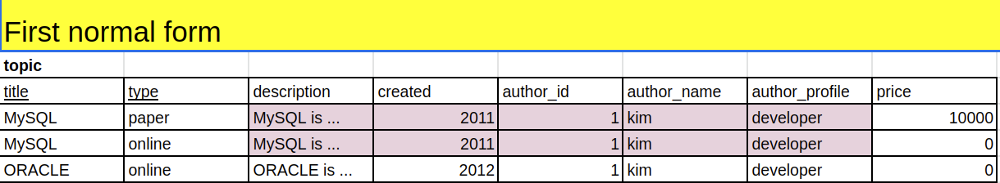
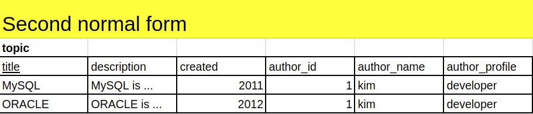
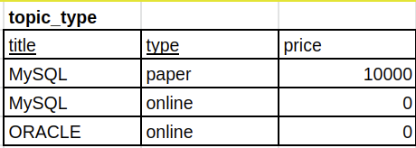

# 정규화
> [생활코딩 관계형 데이터 모델링](https://opentutorials.org/course/3883/25301)

- 산업적으로 제 3 정규형 까지 많이 사용된다.

- 제1 정규화 Atomic columns
- 제2 정규화 No partial dependencies
- 제3 정규화 

## 제 1정규화
> Atomic columns

- `SELECT * FROM TOPIC WHERE tag='free'`와 같은 query를 사용할 수 없다.

- 표를 쪼개야 한다. (`topic table`,`tag table`)

- N:M cardinality는 연결 테이블이 필요하다. (`topic_tag_relation table`)

## 제 2정규화
> No partial dependencies, 중복키

- 중복된 row가 존재한다.
- price는 type에 의존하는 column이다.

- 그러므로 topic table은 2개의 table로 쪼개질 수 있다.
- 이외의 table은 제 1 정규형 table과 동일

## 제 3정규화
