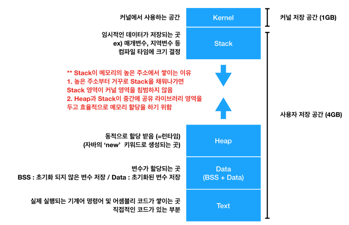

[참고 자료](https://github.com/JaeYeopHan/Interview_Question_for_Beginner/tree/master/OS)
[운영체제 및 기타 자료 정리 잘된 곳](http://www.jidum.com/jidums/view.do?jidumKindCd=Oh)

# 프로세스와 스레드 차이
- https://bowbowbow.tistory.com/16

- 
## 프로세스
- 실행 중인 프로그램
- 메모리에 적재, cpu의 할당을 받을 수 있는 것
- 프로세스 스택(함수의 매개변수, 복귀 주소, 로컬 변수등의 임시자료) + 데이터 섹션(전역 변수들을 수록) + 메모리 힙(프로세스 실행 중 동적으로 할당되는 메모리)+ Code(text)

- `PCB(Process Control Block)`
    - 하나의 프로세스당 PCB 한개
    - 특정 프로세스에 대한 중요한 정보를 저장하고 있는 os 자료구조
    - 프로세스 전환 발생시, 이때 까지 프로세스의 진행사항을 저장.
    - 구성 요소
```
- PID: 프로세스 id
- State: new, ready, running, waiting, terminated
- PC(Program Counter): 프로세서 내부에 있는 레지스터 중 하나,명령어 포인터,실행할 기계어 코드의 위치 포인터
    - 명령어를 하나 실행시킬 때마다 카운터의 값을 증가시켜 명령어의 흐름을 제어가능하다.
- 스케줄링 우선순위: 프로세스의 우선순위와 스케줄 큐에 대한 포인터
- CPU 레지스터(accumulator, 누산기 등): 연산 중간값 저장
- 권한: 프로세스가 접근 가능 자원 권한
- 부모 자식 프로세스 정보: init 프로세스를 제외한 모든 프로세스는 복제를 통해 생성, 이때 계층관계 트리를 형성한다. 
- `프로세스의 데이터, 명령어가 있는 메모리 위치 포인터`: 프로세스는 실행중인 프로그램이므로, 프로그램에 대한 정보를 가진다.
- 실행문맥: 마지막 실행한 레지스터 내용
```
[참고하면 좋을 링크](https://gmlwjd9405.github.io/2018/09/14/process-vs-thread.html)
## 스레드
- 프로세스의 실행 단위
- 한 프로세스 내에서 동작되는 여러 실행 흐름
- 프로세스 내의 주소 공간이나 자원을 공유 가능
- 독립적인 작업 수행을 위해 각자의 스택, pc레지스터를 보유

## 멀티 스레드

### 멀티 스레딩의 장점

- 메모리 공간(pcb), 시스템 자원(통신비용) 소모 경감
- 스레드의 context switch는 프로세스와 달리 캐시 메모리를 비울 필요 없어 더 빠르다.
    - "혼자 생각해보니 cache 메모리를 비울 필요없다는 뜻은, 캐시에 pcb가 적재되어있기 때문인 것 같다."

### 멀티 스레딩의 단점
- 멀티 프로세스는 공유 자원이 없지만, 멀티 스레딩의 경우 공유자원이 생긴다.(데이터, 힙메모리)

- 위의 문제로 별도의 동기화 작업(작업 처리 순서 컨트롤, 공유자원 접근 컨트롤)이 필요하다. 
- 하지만 이러한 동기화 처리로 인하여 병목현상이 발생하여 성능 저하될 수 있다.

### 멀티 스레딩 vs 멀티 프로세싱

- 스레딩: 적은 메모리 공간, 문맥 전환 빠르지만, 1) 오류로 인해 하나의 스레드가 종료되면 전체 스레드가 종료 될 수 있다. 2) 동기화 문제
- 프로세싱: 어떤 프로세스의 에러가 다른 프로세스에 영향을 주지 않아 안정적, 많은 메모리 공간과 cpu 시간을 소모


### c.f
- `멀티프로그래밍`: 프로세서의 자원 낭비를 최소화하기 위해 낭비되는 시간을 다른 프로그램 수행에 쓰게 하여, 하나의 프로세서에서 여러 프로그램(프로세스)을 교대로 수행할 수 있게 하는 것이다.
- `멀티 태스킹`: 멀티프로그래밍과 다른 점은 프로그램과 Task의 구분으로도 그 의미가 다르겠지만 멀티프로그래밍이 낭비되는 자원을 최소화 하기 위해 교대로 실행하였다면 멀티태스킹은 좀 더 확장해서 정해진 시간 동안 교대로 Task를 수행. 여러 일을 동시에 교대로 처리한다는 점에서 멀티프로그래밍과 멀티태스킹과 그 의미가 같다. 둘의 차이점을 구별하는 것은 서로 상이한 관점이 존재하기 때문에 멀티프로그래밍이라는 용어보다 멀티태스킹이라는 용어를 쓰는 것이 일반적이라는 것을 알아두자.

### Race Condition
> https://baked-corn.tistory.com/8?category=718232
> 한 메모리의 값에 동시에 접근하는 현상
- 여러 프로세스가 공유 메모리에 접근하면 `Race Condition`이 발생한다. Race condition의 원인이 되는 코드를 `Critical Section`라고 하며 이를 해결하기 위해서는 3가지를 만족해야 함
    - Mutual Exclusion
        -   하나의 프로세스가 Critical Section에 접근하였으면 다른 프로세스는 접근하지 못해야 한다.
    - Progress
        - 어떤 프로세스도 Critical Section에 들어가 있지 않았을 때 어느 프로세스를 들어가게 해야 하는지 결정해주어야 하고 이러한 결정과정은 무한정으로 지연돼서는 안된다.
    - Bounded Waiting
        - 프로세스가 Critical Section에 들어가기로 했으면 무한정 기다려서는 안된다. 일정 시간 안에 들어가야 한다.

- 이를 해결하기 위해, mutex, semaphore등이 등장
### Semaphore
> https://baked-corn.tistory.com/9?category=718232
> 정수형 변수 Mutex와 두 함수(wait(Mutex) 와 signal(Mutex)) 로 구성
- Mutex key를 통해 프로세스 작업 순서를 정해준다.
    - Mutex 1인 녀석이 Critical Section에 있는데, contex switching이 일어나면 mutex가 0인 녀석이 들어오면 wait한다.

- wait하는 동안 mutex 보면서 `Busy Waiting`하는 방식, `Blocking & Wake-UP`(Wait Queue,Ready queue))방식이 있다.

- `Blocking & Wake-up`
    - 빈번한 context switching이 일어난다, busy waiting은 context switching이 적다.
    - wait(mutex)에서 무한 loop가 아닌, mutex를 획득하지 못하면 해당 프로세스가 block call을 하여 suspend시킨다. 이 프로세스 PCB를 semaphore에 대한 wait queue에 넣는다.
    - 그 뒤 lock이 release되면, Ready queue에 넣고 Ready queue 알고리즘에 따라서 pop 하여 Critical에 들어가도록 한다.

- Q) Critical에서 나오는 시점은, task를 완료한 시점인가 아니면 timeout인가?

- semaphore의 문제점(2)
    - DeadLock & Starvation
    - Priority Inversion

### DEAD LOCK과 그에따른 해결 방법

- Dead lock 발생4가지 조건 (하나라도 풀어주면 된다.)
    - Mututal Exclusion
    - Hold and Wait
    - No Preemption ( 갖고 있는 자원을 프로세스가 스스로 반납하기 전까지는 회수되지 않는 조건)
    - **Circular Wait (이녀석 핵심)**
        
> https://baked-corn.tistory.com/13?category=718232
- DeadLock Prevention
    - Circular Wait의 경우 자원들의 Total Ordering을 반환하는 F()함수를 사용한다.
    - 프로세스는 현재 소유하고 있는 자원의 타입의 F() 함수 우선순위보다 높은 우선순위의 자원들만 요청할 수 있으며 소유하고 있는 자원의 우선순위가 가장 높다면 소유하고 있던 자원들을 모두 반납하게 됩니다.
- DeadLock Avoidance
    - Bankers Algo(자원 인스턴스 다수일 경우)
    - Safety Algorithm

- DeadLock detection
> https://baked-corn.tistory.com/14?category=718232
    - Deadlock이 일어난 후, 발견하여 해결하는 방법


### Paging기법(외부단편화 해결,내부단편화 존재)
> https://medium.com/@esmerycornielle/memory-management-paging-43b85abe6d2f
- 페이징이란 primary storage(RAM)에서 secondary storage(Drive/HDD/SSD)의 데이터를 read/write할 수 있도록 하는 방법중 하나이다.

- 메모리 단편화를 해결방법에는 compaction/segmentation/paging 방법이 있는데 Paging은 segment 방식에서 블록 크기를 통일 시켜준다. RAM을 페이지(block) 크기와 같이 나눈것을 page frame이라고 함.

- 페이징 기법이란 사용하지 않는 프레임을 페이지에 옮기고, 필요한 메모리를 페이지 단위로 프레임에 옮기는 기법

- TLB라는 캐시를 사용해 효율성을 꾀한다.


### 프로세스 구성요소 (4)
> https://jungwoon.github.io/android/2019/07/16/Process-Thread/
</img>
- 논리적 OS란 Kernel영역위에 프로세스를 쌓은 것 (이때의 메모리는 어디를 말하는가? Ram/ 캐시는 CPU에 들어있다.)

- Kernel 영역
    - Kernel
        - 운영체제가 실행되기 위해 필요 핵심 부분
        - 시스템콜, 메모리제어, 태스트 매니저 등

- User 영역
    - Stack
        - 임시 데이터 쌓이는 공간
        - 컴파일 타임에 크기 결정
    - Heap
        - 동적으로 할당(=런타임)
    - Data
        - 변수가 할당 되는 곳 (BSS + Data) , Global & Static variable
        - BSS: 초기화 x 변수
        - Data: 초기화 0 변수
    - Text
        - 실제 실행되는 기계어 명령어 및 어셈블리 코드 쌓임

- **Stack이 메모리의 높은 주소에서 쌓이는 이유**
    - 높은 주소부터 거꾸로 Stack 채워나가면 Stack 영역이 커널 영역을 침범하지 않음
    - Heap과 Stack 중간에 공유 라이브러리를 두어 효율적 메모리 할당

- 메모리에 올라와 실행되고 있는 프로그램 인스턴스 
- 운영체제로부터 시스템 자원을 할당받는 작업의 단위
- 

- Q) 여기서 메모리는 RAM인가? ㅇㅇ
    - **RAM**
        - 램은 컴퓨터 프로세서가 빠르게 접근할 수 있도록 하기 위해, OS, 응용프로그램 그리고 데이털르 유지하고 있는 저장소이다.
        - 전원이 다시 켜지면 HDD에 있던 OS나 File들이 다시 램에 적재된다.
- Q) 그렇다면 메모리에 프로그램은 어떤식으로 저장되는가?


### IPC(==RPC, RMI, ) 방식 2가지의 장단점
- Shared Memory
    - collision 발생 가능(-> Race condition -> lock -> Deadlock), 즉 동기화 문제 발생
    - 오버헤드 적다.
    - 메모리 제한이 덜하다. (극 대량 가능)

- Message passing
    - 각 프로세스들이 Kernel에 message를 보내고, kernel이 전달해준다.
    - 운영체제를 거쳐야 하기 때문에 Shared Memory에 비해 속도가 느리다.
    - 동기화 문제가 없어 안전하다.
    - 커널에 buffer를 두고 통신하여 OS-level에서 동기화를 처리해준다. 다만 buffer의 크기 제약이 있어 극 소량만 가능하다.

### Non-blocking, Asynchronous, Concurrency

> https://tech.peoplefund.co.kr/2017/08/02/non-blocking-asynchronous-concurrency.html


[blocking/non-block and sync/async](http://wiki.sys4u.co.kr/pages/viewpage.action?pageId=7767390)
- Non blocking
    - Non-blocking algorithm(Non-blocking synchronization)
    - Non-blocking I/O
        - I/O작업이 완료 될 때까지 wait-time이 필요하여 프로세스가 멈추었던 기존의 sync/blocking 방식과 달리, I/O 요청 이후 즉시 다음 작업을 처리하도록 함.
        - 이후 I/O작업이 완료된 시점에 후속 작업을 이어서 진행할 수 있도로 약속을 한다. (Callback func, Polling)
            - `폴링`:어떤 시스템 콜이 성공적으로 실행될때까지 계속 루프를 돌면서 확인하는 방법
                - 불필요한 확인요청 오버헤드(시스템콜)
                - 어플리케이션에서 최초 데이터 요청 후 시스템에서 작업은 이어지고 시스템에서 Output이 준비되지 않은 상태를 어플리케이션에 즉시 반환하며 blocking 이 발생하지 않는다. 하지만 해당작업 이후 어플리케이션에서는 시스템으로 지속적인 데이터 상태 체크를 하게된다. 시스템 버퍼에 데이터가 저장될때까지 해당 작업을 지속한 후 시스템에서 데이터가 적재되면 그때 어플리케이션 버퍼에 저장된 후 종료된다.
                - 이렇게 지속적으로 상태를 체크하여 데이터를 받는 방식을 Polling 이라 한다. Blocking에 대한 낭비는 없지만 반복적인 시스템 호출이 일어나게되므로 CPU 자원이 낭비된다.
            - `CallBack`
                - Looper and message queue를 통해서 메시지를 입력받고, looper를 통해서 지속적으로 callback을 체크한다. 


---------------------------
> 공룡책 정리

# 1. 서론

### 1.10.2 트리

- general tree(일반트리)
- binary tree(이진트리)
- binary search tree(bst,이진탐색트리)
- self-balancing binary search tree(균형이진 탐색 트리)
    - `AVL`
    - `red_black tree`


